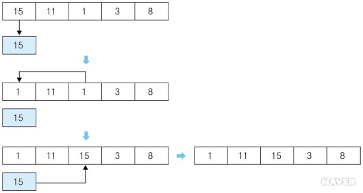
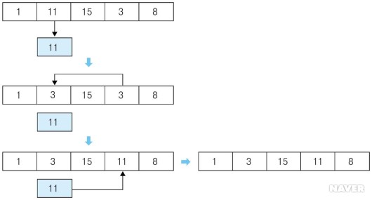
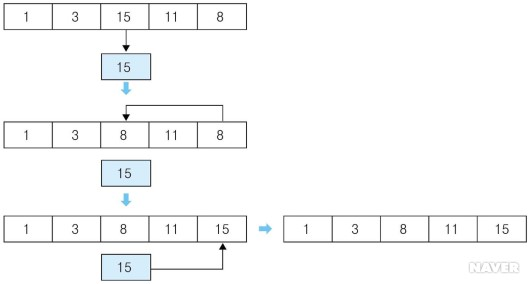
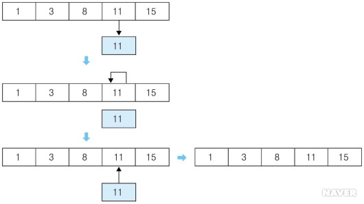

# Selection Sort #

## 1. 개념
- 선택 정렬(Selection Sort)은 정렬되지 않은 데이터들에 대해 가장 작은 데이터를 찾아 가장 앞의 데이터와 교환해나가는 방식이다. 

## 2. 동작 과정
- ![[그림 8-1] 정렬되지 않은 데이터](./image/Selection.jpg)

  **[그림 8-1] 정렬되지 않은 데이터**

- 가장 작은 데이터인 1을 가장 앞에 위치한 15와 교환한다. 가장 작은 데이터가 가장 앞에 위치하게 된다.

  

- 첫 번째 데이터를 제외한 나머지 데이터에서 가장 작은 데이터인 3을 두 번째 데이터인 11과 교환한다.

  

- 첫 번째, 두 번째 데이터를 제외한 나머지 데이터에서 가장 작은 데이터인 8을 세 번째 데이터인 15와 교환한다.

  

- 첫 번째, 두 번째, 세 번째 데이터를 제외한 나머지 데이터에서 가장 작은 데이터인 11을 네 번째 데이터인 11과 교환한다. 같은 데이터이므로 위치의 변화는 없다.

  

- 데이터들에 대한 정렬이 완료된다.

  

## 3. 코드
```c++
#include <stdio.h>
const int MAX = 10000;

int main() {
  int data[MAX], size;
  
  scanf("%d", &size);
  
  for(int i = 0; i < size; i++) {
    scanf("%d", &data[i]);
  }
  
  for(int i = 0; i < size; i++) {
    int inx = i;
    for(int j = i; j < size; j++) {
      if(data[inx] > data[j]) {
        inx = j;
      }
    }
    
    int temp;
    temp = data[i];
    data[i] = data[inx];
    data[inx] = temp;
  }
  return 0;
}
```
