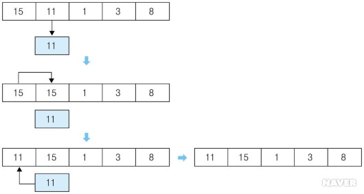
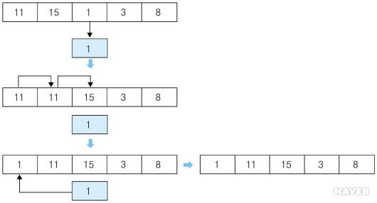
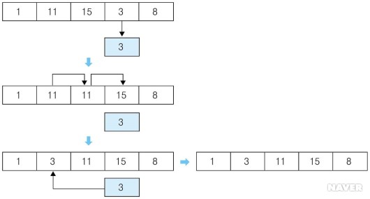
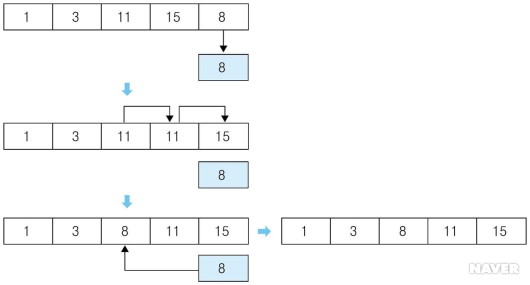

# Insetion Sort

## 1. 개념
- 삽입 정렬은 아직 정렬되지 않은 임의의 데이터를 이미 정렬된 부분의 적절한 위치에 삽입해 가며 정렬하는 방식이다.
- 그러면 삽입 정렬의 동작 과정을 [그림 8-2]의 데이터를 이용해서 살펴보자.

## 2. 동작 방식

- 빈 배열

  

- 두 번째 데이터 11과 바로 앞에 위치한 15의 크기를 비교한다. 두 번째 데이터가 작으므로 15를 한 칸 뒤로 보내고 11을 15 앞에 위치시킨다.

  

- 세 번째 데이터인 1과 앞에 위치한 11, 15의 크기를 비교한다. 1이 가장 작으므로 11과 15를 한 칸씩 뒤로 보내고 1을 가장 앞에 위치시킨다.

  

- 네 번째 데이터인 3과 앞에 위치한 1, 11, 15의 크기를 비교한다. 3은 1보다 크고 11, 15보다 작으므로 11과 15를 한 칸씩 뒤로 보내고 3을 11 앞에 위치시킨다.

  

- 마지막 데이터인 8과 앞에 위치한 1, 3, 11, 15의 크기를 비교한다. 1, 3보다 크고 11, 15보다 작으므로 11과 15를 한 칸씩 뒤로 보내고 8을 11 앞에 위치시킨다.

  

- 데이터들에 대한 정렬이 완료된다.

  

## 3. 코드
```c++
#include <stdio.h>
const int MAX = 10000;

int main() {
  int data[MAX], size;
  
  // 정렬 전 배열 입력
  scanf("%d", &size);
  for(int i = 0; i < size; i++) {
    scanf("%d", &data[i]);
  }
  
  // 정렬
  for(int i = 0; i < size; i++) {
    for(int j = i; j >= 1; j--) {
      if(data[j - 1] > data[j]) {
        int temp;
        temp = data[j - 1];
        data[j - 1] = data[j];
        data[j] = temp;
      }
      else break;
    }
    
    int temp;
    temp = data[i];
    data[i] = data[inx];
    data[inx] = temp;
  }
  
  // 정렬 결과
  for(int i = 0; i < size; i++) {
    printf("%d ", data[i]);
  }
  
  return 0;
}
```

## 4. 시간복잡도

- Θ (n 제곱)

## 5. 출처

- [네이버 지식백과](https://terms.naver.com/entry.nhn?docId=2270436&cid=51173&categoryId=51173)